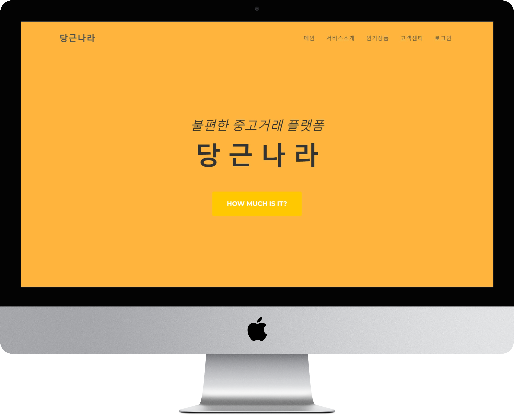
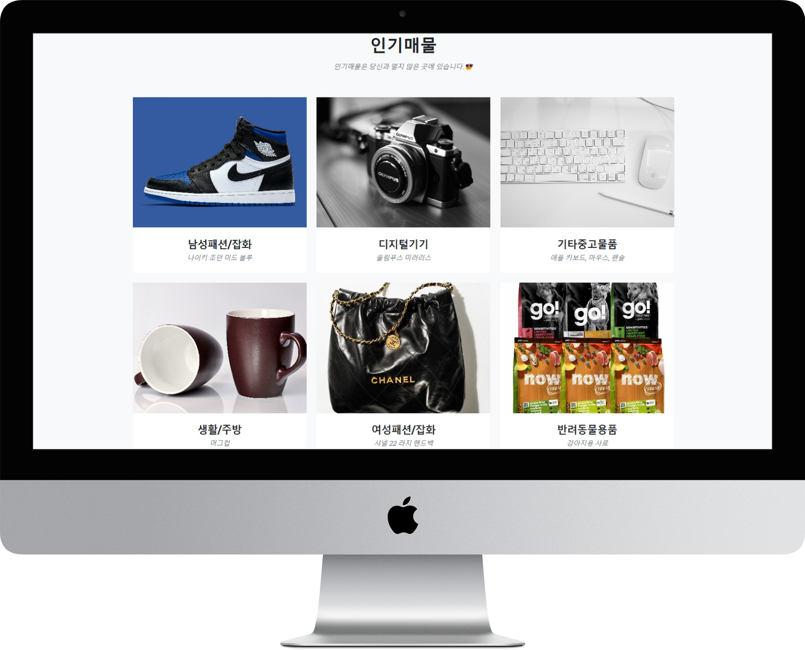
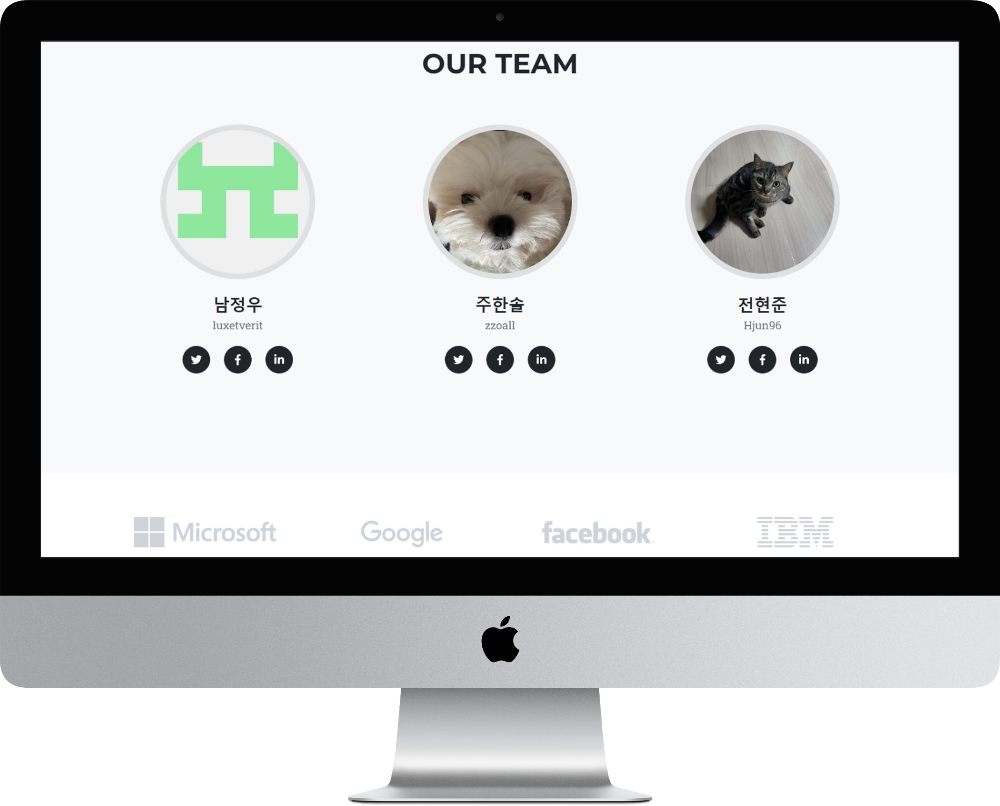
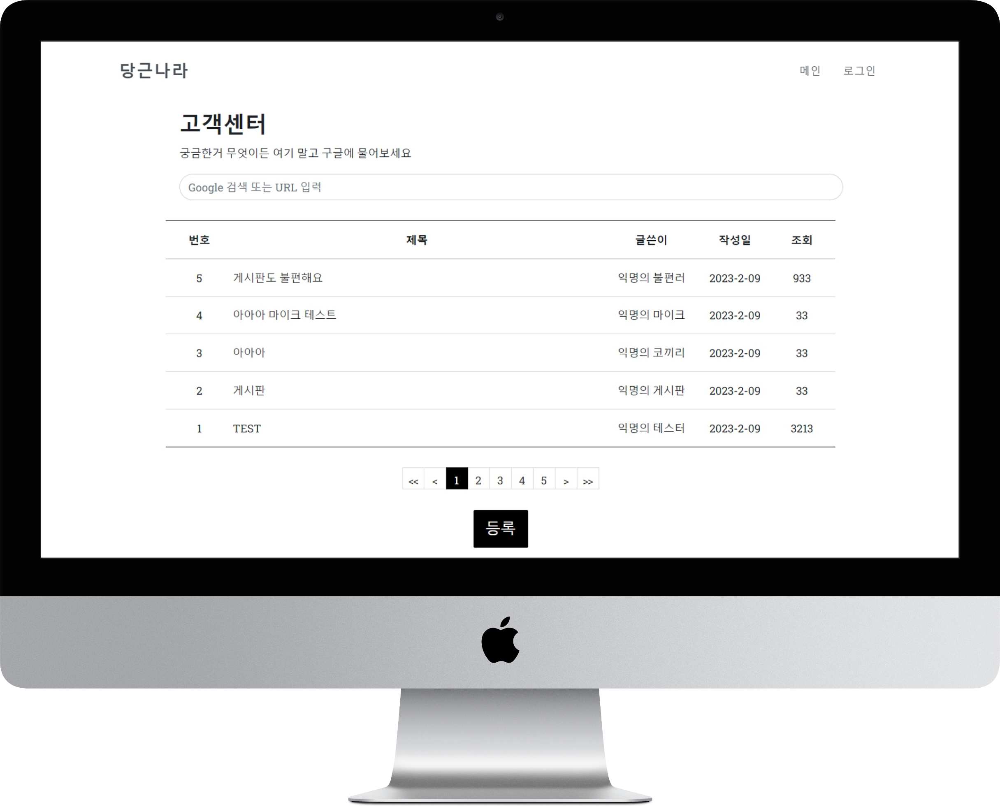
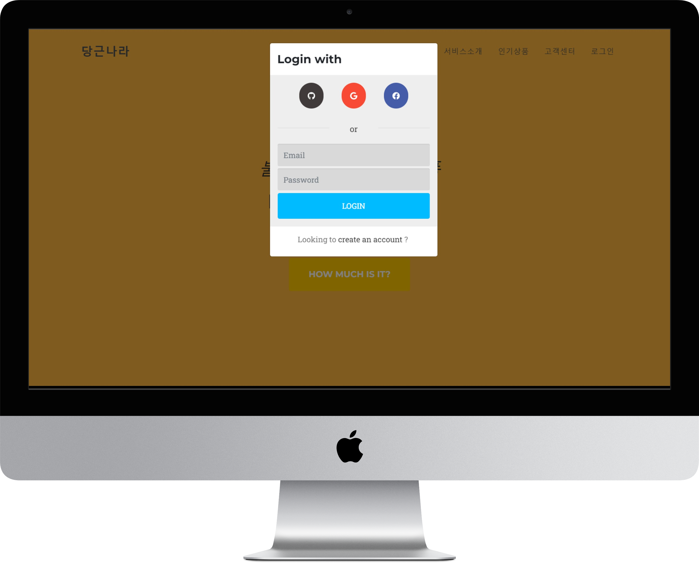

# 당근나라

## 서비스 주제

다소 불편한 중고거래 플랫폼

## 서비스 개요

쓰기엔 불편하고 어색하지만
보기에는 그럴듯한 중고거래 플랫폼

## 서비스 링크

[GitHub Hosting](https://luxetverit.github.io/miniproject5-website-dgnara/index.html)

## 서비스 목업

### 메인

### 서비스 소개

### 인기매물

### 상품디테일

### 팀원소개

### 게시판

### 로그인

## 시연 영상

시연영상

## 조원(이름순)

### 남정우

-   역할 : 게시판 구현, 로그인 화면 구현
-   Trouble Shooting :  
     여러 파일을 쓰다보니 css 다루는게 힘들다.
-   의견 :
    서버 없이 html로만 만드니까 코드량이 많아서 보기 불편했다.  
    css는 하기싫다.  
    백엔드를 두고 게시판, 로그인, 채팅 기능들을 구현해보고 싶다.
    React.js로 해보고 싶다.

### 전현준

-   역할 : 정보수집, 프로필 편집, 검토 
-   Trouble Shooting :
-   의견 : 
    css가 길어서 하나를 바꾸면 나중에 찾기가 힘들다.
    
    그래도 튼튼한 뼈대로 이루어진 결과물이 나와서 기분이 좋다.
    
    아직은 뼈대만 갖추어졌을뿐이라 움직일 근육들도 붙여보고싶다.

### 주한솔

-   역할 : 인기매물 갤러리 구현(이미지 슬라이드 기능, 채팅기능 연결, 모달창 레이어 팝업 레이아웃 수정)
-   Trouble Shooting : 갤러리 구현하는데 엄청 애먹었습니다. 이미지 크기 조정하는 것이 이렇게 복잡할줄이야..
                       css 여러파일을 사용하면 접근이 쉬우니 작업이 수월할 것이라 생각했는데,
                       하나를 수정하면 또다른 하나가 작동이 안되는 그런 불균형을 바로잡기가 힘들었습니다.
-   의견 : 정우님의 의견처럼 백엔드 작업을 더해서 로그인, 게시판, 실시간채팅창을 실제로 구현해보고 싶습니다.
    닉네임 프로필 회원상세정보페이지도 만들어보고 싶어요.
    css 너무 힘든데 계속 파고들게 됩니다.(?)
    이번 웹사이트만들기 프로젝트를 진행하며 잘 몰랐던 기능도 배웠고 직접 부딪혀서 만들어보았더니 오히려 더 공부가 되는 것 같습니다.
    모두들 화이팅 !
           
